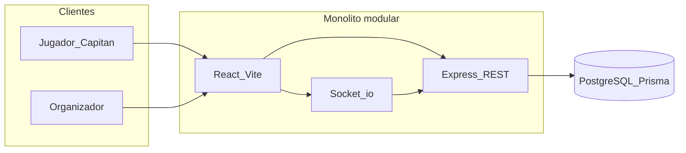

# Contexto del proyecto Pugnara

Has pedido **solo tomar contexto, sin implementar nada**. Este plan queda como referencia para sesiones futuras.

## Visión del producto

Plataforma web para **gestionar torneos eSports**: jugadores/capitanes crean equipos, se inscriben a torneos (LoL, Valorant, etc.), ven brackets y reportan resultados; administradores crean torneos, generan llaves, moderan disputas y comunican avisos. **Actualizaciones en tiempo real** vía WebSockets.

## Stack objetivo (según tu especificación)

| Capa | Tecnología planificada |
|------|------------------------|
| Frontend | React + Vite, Tailwind, React Query, Zustand |
| Backend | Node + Express (REST), Socket.io |
| Datos | PostgreSQL + Prisma |
| Infra | Docker local; deploy FE/BE/DB en cloud |

## Módulos funcionales (backlog de producto)

- **Usuarios:** auth email + OAuth (Discord/Google), equipos e invitaciones, inscripción por capitán, partidas, reporte con capturas.
- **Administradores:** CRUD torneos, brackets (seed aleatorio/manual), disputas/baneos, avisos a participantes.
- **Sistema:** tiempo real en resultados/brackets, notificaciones de turno.

## Estado actual del repositorio

Estructura: [`Pugnara/Frontend`](C:\Users\gabri\Documents\Programacion\Universidad\ProyectoDeGrado\Pugnara\Frontend) y [`Pugnara/Backend`](C:\Users\gabri\Documents\Programacion\Universidad\ProyectoDeGrado\Pugnara\Backend). Raíz con [`.gitignore`](C:\Users\gabri\Documents\Programacion\Universidad\ProyectoDeGrado\Pugnara\.gitignore) vacío.

### Frontend

- Scaffold **Vite + React 19** ([`Frontend/package.json`](C:\Users\gabri\Documents\Programacion\Universidad\ProyectoDeGrado\Pugnara\Frontend\package.json)): scripts `dev`, `build`, `lint` (oxlint).
- Dependencias actuales: solo `react` / `react-dom`. **Sin** Tailwind, React Query ni Zustand.
- UI: plantilla por defecto de Vite en [`Frontend/src/App.jsx`](C:\Users\gabri\Documents\Programacion\Universidad\ProyectoDeGrado\Pugnara\Frontend\src\App.jsx) (contador, enlaces a docs).

### Backend

- [`Backend/package.json`](C:\Users\gabri\Documents\Programacion\Universidad\ProyectoDeGrado\Pugnara\Backend\package.json): `express` ^5.2.1, `dotenv` ^18.0.1; sin script `start`/`dev`; `main` apunta a `index.js` pero el código está en [`Backend/server/index.js`](C:\Users\gabri\Documents\Programacion\Universidad\ProyectoDeGrado\Pugnara\Backend\server\index.js).
- Entrada actual: instancia Express vacía (`import express`, `const app = express()`), **sin** listen, rutas, middleware ni `"type": "module"` en package.json (posible fricción ESM/CJS al ejecutar).
- **Sin** Prisma, Socket.io, capas modulares (routes/controllers/services), ni Docker en el repo.

### Brecha visión vs código

| Área | Objetivo | Hoy |
|------|----------|-----|
| Dominio (torneos, equipos, partidas) | Modelo + API | No existe |
| Auth / roles | JWT/OAuth + admin | No existe |
| Tiempo real | Socket.io | No existe |
| UI gamer | Tailwind + flujos UX | Plantilla Vite |
| DevOps | Docker + env documentado | No hay compose/README |

## Notas técnicas para cuando avances

1. **Convención monolito modular:** separar Backend en módulos por dominio (`users`, `teams`, `tournaments`, `matches`, `notifications`) con capas route → controller → service → Prisma.
2. **Frontend:** enrutamiento (React Router), capa API (React Query), estado de sesión/UI (Zustand), diseño con Tailwind.
3. **Tiempo real:** rooms por torneo/partida; eventos al confirmar resultados o resolver disputas.
4. **Ajustes inmediatos del scaffold** (cuando lo pidas): alinear `main`/scripts del Backend, ESM, `.gitignore` (node_modules, `.env`), y no commitear secretos.

## Próximo paso (cuando tú lo indiques)

No se ejecutará código hasta tu instrucción. Opciones típicas después de este contexto:

- Fundación: Prisma schema + Docker Postgres + Express bootstrap + health check.
- Fundación FE: Tailwind + router + layout “gamer”.
- Primer vertical slice: registro/login + rol básico.
- Documento de arquitectura / reglas Cursor para el equipo (Gabriel, Jhan, Camilo).
